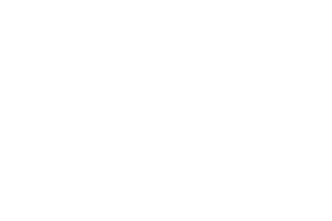

# napari-macrophage

A Napari plugin for macrophage image visualisation, mask editing, Otsu/Watershed segmentation, YOLO-format bbox export/import, and cell analysis.

---



## Features
- Load image (CD206, optional DAPI) and 3D mask.
- Click-to-select object in Masks; delete object in a single slice or across all slices; change or assign new ID; renumber objects.
- View / edit a single object via an “Object {id}” layer.
- ROI workflow: draw a bounding box --> preview Otsu segmentation (preview mask with postprocessing and can be adjusted with slider) --> optional Watershed --> save 3D mask. 
- Annotate bounding box and export/import YOLO bounding box: export annotated bounding boxes as YOLO styled .txt file; import bounding boxes from .txt.
- Perform cell analysis.

---

## Installation

Install the dependencies and the plugin via pip:

with conda:
```bash
conda create -n mic_napari python=3.11 -y
conda activate mic_napari
```

with pip (if not with conda):
```bash
python -m venv .mic_napari
source .mic_napari/bin/activate
```

```bash
pip install -r requirements.txt
pip install -e .
```

Launch Napari:
```bash
napari
```

---
## Usage

### **1. Load data**

Please use the following menu options to load your images and masks:
  - Plugins → napari-macrophage → Load Image + Mask
  - Expected input format:
    - **Image**: (Z, Y, X) or (C, Z, Y, X), where C = 2 or 5. For 4D images, the axis with the smallest dimension is assumed to be the channel axis. The expected channel order is: collagen, F480, CD206, DAPI.
    - **Mask**: (Z, Y, X)

  You will see the following layers in the layer list:
  - **CD206** layer: image layer showing the CD206 channel.
  - **DAPI** layer: optional image layer showing the DAPI channel.
  - **Masks** layer: labels layer showing macrophage IDs (0 = background).

  Additional layers may appear later:
  - **ROI** layer: shapes layer for drawing rectangle bounding boxes (stored as 4 corners [z, y_min, x_min], [z, y_min, x_max], [z, y_max, x_max], [z, y_max, x_min]).
  - **Preview Mask** layer: labels layer for Otsu/ Watershed preview.
  - **Object {id}** layer: temporary labels layer showing one selected object.

  You can also open files via the default Open File option in the menu bar. After clicking on **Edit CD206 + DAPI + Masks**, the images and masks will be prepared for use with the plugin’s functionalities. This currently only supports image of shape (Z, Y, X) or (2, Z, Y, X). It would still be better to load via Plugins → napari-macrophage → Load Image + Mask in the current version of plugin.


### **2. Edit masks**
  - Plugins → napari-macrophage → Edit CD206 + DAPI + Masks

After running, additional dock widgets will appear on the right-hand side to support customised functionalities.

When the **Masks layer is active**:
  - **Delete in Slice**: remove the connected component of the selected (click on the object to select) object in the **current slice only**. Other slices with the same object ID remain unchanged. Please remember to click on the background to deselect an object, to avoid accidentally deleting it.
  - **Delete in ALL Slice**: remove the object with the specified ID completely across **all slices**.
  - **Change ID**: assign a new object ID to the connected component of the selected object in the current slice.
  - **New ID**: assigns next available ID to the clicked component.
  - **Renumber All**: reassign object IDs so that they are consecutive after deleting objects.
  - **View Object**: select an object ID and click View Object to create a new Object layer in the layer list. You can then view and edit the object mask of the corresponding macrophage in this layer.

     Optional: You can also use any built-in tools of Napari (e.g., label eraser, paint brush, polygon tool) to edit mask shapes or create new masks in the Mask/ Preview Mask/ Object layer.

When the **Object x layer is active**:
  - Changes made in the Masks layer are automatically reflected in the Object layer.
  - You can edit the object mask using Napari's built-in tools.
  - To save the changes back to the Masks layer, please click **Apply Changes**; otherwise, changes will **not** be visible in the the Masks layer. 
  - To change object IDs or delete objects, please select the Masks layer as the active layer.

### 3. Segmentation
**Segmentation** workflow: 
  1) **Add Bbox**: create an new ROI layer in the layer list. User can draw a bounding box (using the Add Rectangles button provided by Napari) around the missing object on this layer. The bounding box will be copied from the current slice forward to form a 3D ROI. The plugin then automatically runs Otsu thresholding within the 3D ROI. A new Preview Mask layer is created to show the candidate object mask. A threshold slider is provided so that you can adjust the segmentation interactively. You can directly edit the Preview Mask layer using Napari’s built-in tools to refine the segmentation.

     Note: when computing the segmentation mask, the plugin automatically performs 
       - per-slice validation: continuity check (if an object is not predicted in >= 3 consecutive slices, any subsequent predictions are ignored) and IoU check (remove predictions that do not overlap with at least one of the previous 2 valid slices), 
       - post-processing (binary opening and closing, small objects removal).
    

  2) **Save Otsu 3D**: save the 3D Otsu mask. The previewed object with any possible changes will be written back to the Masks layer with the next available ID. The ROI and Preview Mask layers are removed automatically.

     Note: it performs a duplicate check. Before adding the previewed mask to the Masks layer, the plugin checks the next two slices for objects in the same region using IoU comparison: 
       - if an object at similar location already exists, an iteractive dialog will pop up, asking the user to confirm if they really want to create the mask with a new ID:
         - yes: create a new object;
         - no: discard the new object and return to editing.
       - if no similar object exists: the mask is added directly.

  3) **Run Watershed**: runs watershed based on the current Otsu preview; if no bounding box is detected, it can run on the whole image.

  4) **Save Watershed 3D**: save the entire 3D Watershed mask.


### **4. YOLO export/import (bounding boxes) to/from .txt**
  - **Draw BBox**: draw bounding boxes on ROI layer.
  - **Export**: saves the bounding box as YOLO format.
  - **Import**: read bounding box from .txt and add them to ROI layer. Only boxes corresponding to the current image will be imported.

### **5. Cells analysis (Volume, Surface, Sphericity)**
  - A dialog shows a table with:
    - Label ID
    - Volume [µm³]
    - Surface Area [µm²]
    - Sphericity [–] defined as $\Psi = \frac{\pi^{\frac{1}{3}} (6V)^{\frac{2}{3}}} {A}$
  - Save as .csv: label_id, volume, surface area, sphericity

  Note: Requires voxel size to be set by user. The surface area is approximated with `skimage.measure.marching_cubes` and `mesh_surface_area`. The approximation is not so precise for small cells or cell multiple connected components.

### **6. Isotropic resampling**
Resample CD206 and Masks so that voxel spacing is isotropic:
  - Performs resampling on the currently active layer.
  - Target voxel size = min(current vz, vy, vx) in µm.
  - Image is resampled with trilinear interpolation, mask with nearest-neighbor.
  - New layers “CD206 (iso)” and “Masks (iso)” may be created.

### **7. Save edited masks**
Please use Napari’s built-in **Save** shortcut on your computer.
